# TO DO

- **dark mode** dark mode that changes theme from light to dark for accessibility 
- **fix favicon** favicon currently doesnt load and i cant seem to fix it in any way thats simple
- **edit/delete courts** 
- **location field in court model** address field that converts to corrdinates to be used with google maps to display court locations on map
- **markers on map** markers are clickable and take you to the court page
- **enter postcode field** be able to enter postcode and have the page change to show the courts nearest to you
- **indoor/outdoor buttons** add functionality to outdoor/indoor buttons so they filter out indoor or outdoor courts when pressed
- **am i responsive image** 

# Court Finder Cornwall: Cornwall's Basketball Court Finder

Find. Play. Ball. – Cornwall’s Courts at Your Fingertips!


## Key Features:

1. **User Authentication and Authorisation:** Cornwall Court Finder (CCF) uses AllAuth for user authentication and authorisation, providing a secure way for users to create accounts and log in to add courts and reviews.

2. **CRUD Operations:** The application supports Create, Read, Update, and Delete (CRUD) operations, enabling users to add, view, edit, and delete courts or reviews as they wish.

3. **Intuitive User Interface:** CCF features a intuitive user interface that ensures players can quickly and easily find nearby courts, check reviews, and plan their games without frustration, making the experience seamless and enjoyable.

4. **Editing** Users can easily edit the status of their court/reviews, helping them keep information up to date and ensure other players have the latest details on court conditions and game availability..

5. **Deletion:** Users can delete their courts/reviews, giving them control over their contributions and ensuring the information remains relevant and accurate. .

6. **Responsive Design:** The application is designed to be responsive, ensuring a seamless user experience across various devices and screen sizes.


## User Experience (UX):

Cornwall Court Finder is designed as a simple yet powerful tool for basketball players who value convenience, accuracy, and ease of use. The website’s UX design prioritises simplicity and clarity, providing users with an intuitive interface to find, review, and update court information effortlessly. With a clean and mobile-friendly aesthetic, CFF ensures players can focus on what matters most—getting on the court and playing.

### Site User:

The primary users of CFF are basketball players of all levels who need a quick and reliable way to find and review courts in Cornwall. These users may include casual players, dedicated ballers, and newcomers looking for a place to play. They appreciate the website’s user-friendly design, which allows them to easily search for courts, check reviews, and update court statuses without hassle. These players value convenience, accuracy, and a tool that adapts to their needs, helping them get on the court with minimal effort.

### Goal:

CFF aims to provide basketball players with a seamless and efficient way to discover and review courts, ensuring they can easily find the best places to play. By offering key features such as court search, user reviews, and real-time status updates (with potential future additions like game scheduling and player connections), the website helps players plan their games with ease. The goal is to create a user-focused, mobile-friendly experience that simplifies finding and sharing court information, making it easier for players to get on the court and enjoy the game without hassle.


## Database Structure & Purpose:

### Overview:
CFF uses a PostgreSQL database to store user and task information. The application implements a straightforward database design focusing on the essential requirements of a task management system while maintaining data integrity and user data separation.

### Core Models:

#### User Model (Django Built-in):
The application utilises Django's built-in `User` model from `django.contrib.auth.models`.

**Fields:**
- `id` (Primary Key, AutoField)
- `username` (CharField, unique)
- `password` (CharField)
- `email` (EmailField)
- `first_name` (CharField)
- `last_name` (CharField)
- `is_active` (BooleanField)
- `date_joined` (DateTimeField)

#### Court Model (Custom):
The `Court` model represents individual basketball courts in the system.

**Fields:**
```python
class Court(models.Model):
    INDOOR = 'Indoor'
    OUTDOOR = 'Outdoor'
    COURT_CHOICES = [
        (INDOOR, 'Indoor'),
        (OUTDOOR, 'Outdoor'),
    ]

    title = models.CharField(max_length=200, unique=True)
    slug = models.SlugField(max_length=200, unique=True)
    author = models.ForeignKey(
        User, on_delete=models.CASCADE, related_name="courts"
    )
    content = models.TextField()
    created_on = models.DateTimeField(auto_now_add=True)
    status = models.IntegerField(choices=STATUS, default=0)
    rating = models.DecimalField(
        max_digits=3, decimal_places=1,
        null=True, blank=True,
        validators=[
            MinValueValidator(0.0),
            MaxValueValidator(10.0)
        ]
    )  # Rating from 0.0 to 10.0
    profile_image = CloudinaryField(
        'image', default='placeholder'
    )  # Court image
    excerpt = models.TextField(blank=True)
    updated_on = models.DateTimeField(auto_now=True)

    # Indoor or Outdoor
    court_type = models.CharField(
        max_length=7,
        choices=COURT_CHOICES,
        default=OUTDOOR,
    )

    class Meta:
        ordering = ["-created_on"]

    def __str__(self):
        return f"{self.title} | written by {self.author}"
```

#### Court Model Fields:
1. **title**
- Type: CharField
- Max Length: 200 characters
- Unique: Yes
- Purpose: Stores the name of the basketball court
- Validation: Ensures no two courts have the same title

2. **slug**
- Type: SlugField
- Max Length: 200 characters
- Unique: Yes
- Purpose: Creates a URL-friendly identifier for each court

3. **author**
- Type: ForeignKey (references the User model)
- On Delete: CASCADE (deleting a user removes all their courts)
- Related Name: "courts" (allows reverse lookup from User to Court)
- Purpose: Links a court entry to the user who submitted it

4. **content**
- Type: TextField
- Purpose: Stores a detailed description of the court

5. **created_on**
- Type: DateTimeField
- Auto Now Add: Yes (automatically sets when the court is created)
- Purpose: Tracks when the court entry was first added

6. **updated_on**
- Type: DateTimeField
- Auto Now: Yes (updates whenever the entry is modified)
- Purpose: Keeps track of the last modification date

7. **status**
- Type: IntegerField
- Choices: Defined by STATUS (likely used for draft/published states)
- Default: 0
- Purpose: Manages whether a court listing is visible or in draft mode

8. **rating**
- Type: DecimalField
- Max Digits: 3 (e.g., 10.0)
- Decimal Places: 1
- Nullable: Yes
- Blank: Yes
    - Validators:
    - Min Value: 0.0
    - Max Value: 10.0
- Purpose: Stores the average rating of the court

9. **profile_image**
- Type: CloudinaryField
- Default: 'placeholder'
- Purpose: Stores an image of the basketball court

10. **excerpt**
- Type: TextField
- Blank: True
- Purpose: Stores a short summary of the court entry

11. **court_type**
- Type: CharField
- Max Length: 7 characters
    - Choices:
    - "Indoor"
    - "Outdoor"
- Default: "Outdoor"
- Purpose: Specifies whether the court is indoor or outdoor

## Database Relationships:

The Entity Relationship Diagram is intentionally straightforward to maintain a clear focus on the Minimum Viable Product (MVP).

**User (One) → Court (Many)**
One user can submit multiple courts.
Each court belongs to one user.

**User (One) → Review (Many)**
One user can submit multiple reviews.
Each review belongs to one user.

**Court (One) → Review (Many)**
One court can have multiple reviews.
Each review is linked to a single court.

### Key Points:
1. One-to-Many Relationship:
   - One user can have multiple reviews and court submissions.
   - Each court and review belongs to one user
   - Relationship enforced through foreign key constraint

2. Data Integrity:
   - CASCADE deletion ensures no orphaned tasks
   - Foreign key constraints maintain referential integrity

## Database Design Decisions

### 1. PostgreSQL
PostgreSQL is a powerful, open-source relational database that offers robust features such as ACID compliance, advanced query capabilities, JSON support, and full-text search. It is highly extensible, allowing custom data types and functions, and is designed for scalability with features like concurrency control and horizontal scaling. PostgreSQL’s ACID compliance ensures that user data, court reviews, and other transactions are processed reliably and consistently.

### 2. Model Structure
The model structure of the basketball court finder website follows a minimal design, focusing on the core MVP requirements to ensure a streamlined and efficient user experience. The database schema is designed with simplicity, prioritising essential features such as court locations, user reviews, and search functionality. For user authentication, the website leverages Django's built-in authentication system, providing a secure and scalable solution for managing user sign-ups, logins, and permissions. This approach minimises development overhead while ensuring that authentication is both reliable and easy to implement, allowing the team to focus on the core features of the website without sacrificing security or user management.

### 3. Security Considerations
- User passwords hashed by Django's auth system
- Foreign key relationships protect data integrity
- env.py file used for PostgreSQL URL amongst other sensitive keys
- google maps api key currently in .gitignore js file as env wasnt complying 

### Agile Development: Creating a Kanban Board on GitHub

For the development of Cornwall Court FInder, I adopted an Agile approach to ensure continuous progress and adaptability throughout the project. Central to this methodology was the use of a Kanban board on GitHub Projects, which allowed for clear visualisation and efficient management of the development process. View the [project board here](https://github.com/users/ewanw1lls/projects/8).

The Kanban board acted as the cornerstone of project management, providing a real-time snapshot of task progression. The board was divided into the following sections:


**To Do:** Where tasks for when they are about to be started or planned.

**In Progress:** Tasks actively being worked on were tracked in this column. This provided transparency on ongoing development efforts and helped maintain focus on current objectives.

**Complete:** Successfully completed tasks were shifted to this section for review or testing. This column highlighted the progress made and served as a record of what had been accomplished.

**Backlog:** This column was where tasks and user stories that were identified but not yet prioritised for development were listed.

In my Kanban board, I used the MoSCoW prioritisation technique to organise tasks by categorising them into Must-Have, Should-Have and Could-Have. Ensuring that the most critical features and tasks were completed first, while less urgent ones were addressed later.

### User Stories:

User stories were integral to the development of Cornwall Court Finder, ensuring that each feature was designed to meet the needs of the end-users. These stories were mapped onto the Kanban board, guiding the development process from concept to completion.

Example user stories:

    As a basketball player, I want to sign up and log into an account, so that I can leave reviews and interact with the website.

    Tasks:
        Create a user authentication system with sign-up and sign-in functionality.
        Design a sign-up form with fields for username, email, and password.
        Implement password hashing for security.
        Set up a login form to authenticate existing users.
        Store user credentials securely in a database.
        Display a logged-in user's name and provide a "Log Out" button.
        Restrict review-related actions to logged-in users.
    Acceptance criteria:
        Users should be able to sign up with a unique username, email, and password.
        Passwords must be securely hashed before storage.
        Users should be able to log in using their registered email and password.
        Logged-in users should see a personalised greeting (e.g., "Welcome, [username]").
        A "Log Out" button should be available and functional.
        Only logged-in users should be able to add, edit, or delete reviews.

## User Interface (UI):

- The website features a clean, minimalistic design with a focus on usability and ease of navigation, ensuring users can quickly find nearby basketball courts.
- The UI is controlled through straightforward buttons and interactive elements, ideal for mobile users while maintaining ease of use on larger screens for those browsing on desktops.
- A responsive design ensures that the site is fully functional across different devices and screen sizes, delivering a smooth experience whether users are accessing it from a smartphone, tablet, or desktop.

## Design Principles: 

### Wireframes:

To visualise the user interface and user experience of the application, three wireframes were created: one for mobile screens, one for tablets and one for desktops. These wireframes provide a low-fidelity representation of the application's layout, navigation, and key features.

**Mobile Wireframe:**

The mobile wireframe is designed for the smaller screen and touch-based navigation of mobile devices. Optimised for portrait orientation, it focuses on simplicity and usability.

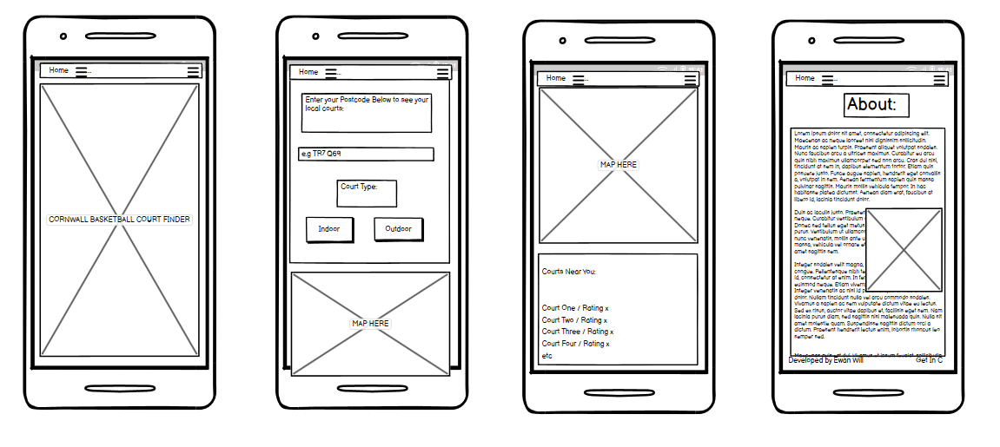

**Tablet Wireframe:**

The tablet wireframe is tailored for the smaller screen and touch-based interaction of tablet devices. It is optimised for portrait mode, emphasising simplicity and ease of use.

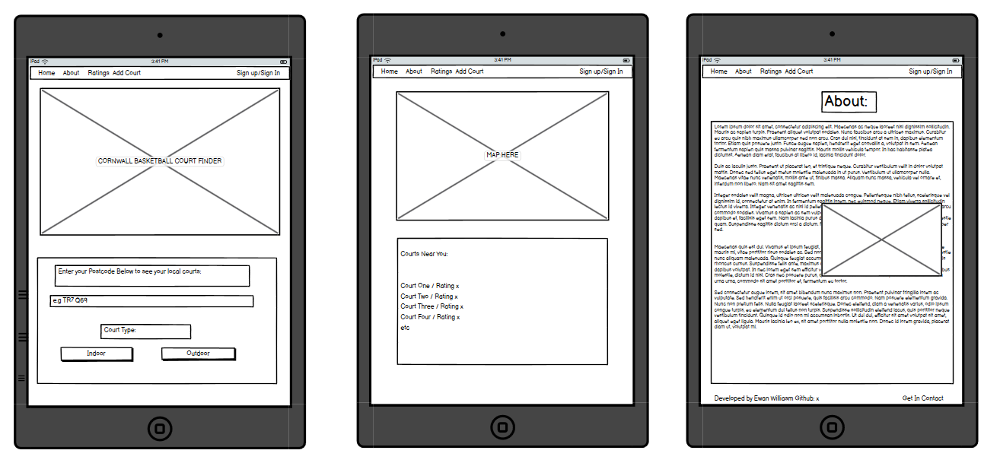

**Desktop Wireframe:**

The desktop wireframe leverages the larger screen and mouse-based interaction to deliver a more detailed, feature-rich experience. Its layout is designed to adapt to various screen resolutions and aspect ratios.

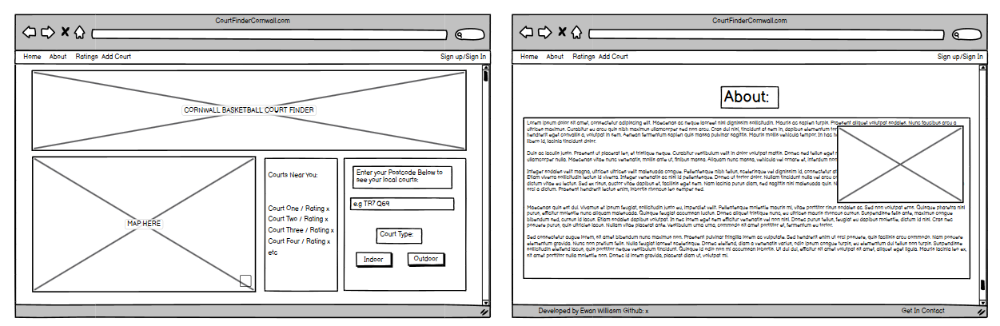

### Colour Scheme:

While the colour scheme was planned during the project's early stages, it hasn't been fully implemented yet, as functionality has been the priority. The colour scheme was chosen with the help of [ColorSpace](https://mycolor.space/?hex=%23FF9671&sub=1), a colour palette generation website.

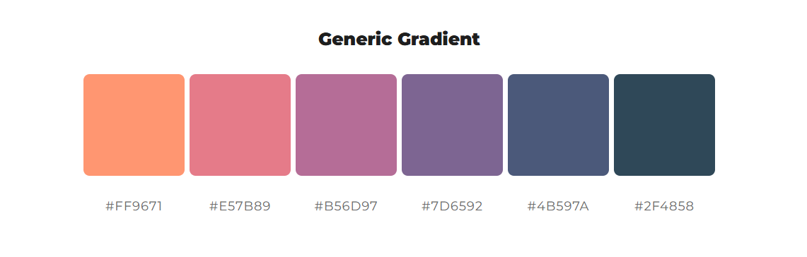

### Primary colours:

- **lightsalmon (#ff9671):** Lightsalmon was chosen for the website’s colour scheme because of its close resemblance to the classic orange-brown of a real basketball. This subtle connection helps create an immediate association with the sport, making the website feel more familiar and relevant to players. The warm and energetic tone of lightsalmon also adds a welcoming and modern touch, helping to engage users while maintaining a visually appealing design.

- **firebrick (#c34a36):**Firebrick was selected to complement lightsalmon, offering a deeper, more grounded contrast that enhances readability and visual hierarchy. Its rich, reddish hue mirrors the darker accents found on basketball courts, such as boundary lines or key markings, reinforcing the basketball theme. Firebrick adds a bold and confident feel to the site, ensuring key elements stand out while maintaining a cohesive and dynamic look.

### Colour Rationale:

Although the colour scheme has yet to be fully implemented—currently only visible in button styles—having a well-defined palette to refer back to will streamline the development and styling process. By using a gradient of complementary colours, the site will achieve a smooth, cohesive, and visually calming aesthetic. This approach ensures a balanced and engaging user experience while reinforcing the site's overall theme.

# Features:

## Templates:

### Base Template (`base.html`):

The base template provides a foundation for the application's layout and design, including the navigation bar, footer, and main content area. It uses Bootstrap for styling and layout, and includes custom CSS for additional design elements.


#### Meta Content:

- **Bootstrap Framework:** This is a widely-used CSS framework for building responsive and mobile-first interfaces.
- **Custom CSS:** The custom CSS stylesheet ('static/css/style.css') is used to visualy expand and enhance beyond bootstrap.
- **Character Encoding:** The character encoding standard used in the template is set to UTF-8 to support a wide range of characters and languages.
- **Fonts:** The font families used in the template are the GoogleFonts Tinos and Montserrat, providing a clean and modern typography.
- **Favicon:** The favicon link are also present in the head, however these files arent currently operational and are listed in the future implementation fo the project.

#### Navigation Bar:

The navigation bar is a critical component of the base template, providing links to essential pages and features of the application. It includes:

***Left aligned:***
- **Court Finder Cornwall Link:** This is decoration and when clicked links to the home index.html page.
- **Home Link:** This Links back to the index.html page 
- **Add Court Link:** When clicked opens a the add_court.html template, presenting the user with a form for adding a new court.
***Right Aligned:***
- **Login and Register Links:** When a user is not logged in links to the login and register pages are available, allowing users to access their accounts or create new ones.
- **Logout Link:** A link to logout of the application is available only when the user is logged in.
- **Username Display:** The navigation bar displays the username of the logged-in user, providing a personalised experience.

#### Main Content:

The main content area displays:

- **Alert Messages:** Alert messages are displayed to provide feedback to the user. These messages are shown near the top of the card, ensuring they are visible without the need for scrolling too far.
- **Logged in as** In the top right hand side is a display message that displayed whether the user is logged in and who they are logged in as.

### Main Page Template (index.html):

The index.html template serves as the main page of the application, displaying a map and a paignated list of all the courts.

#### Meta Content:

- Extends the `base.html` template to ensure a consistent layout and styling across the entire application.
- Utilises `` to load static files.
- `` to allow child tempaltes to override section.

#### Content:
The index.html template displays the following content:

**Title/Slogan:**
A brief, catchy title or slogan that reflects the mission of the website and encourages users to explore further. 

**Google Maps Interactive Map:**
An interactive map powered by the Google Maps API. Users will be able to zoom in, move around, and get a clear view of the area. In the future, custom markers will be displayed for basketball courts, making it easy for users to spot their options visually.

**Courts Near You:**
Currently showcasing the three best-rated courts nearby. This feature is a work-in-progress, but the goal is to help users find highly rated options near their location quickly.

**Enter Postcode Text Field:**
A text input field where users can enter their postcode to find courts nearby. Right now, this feature is temporarily disabled, with placeholder text indicating that the functionality will be available soon.

**Court Type:**
Buttons to filter by court type, either indoor or outdoor. This feature is still under development, but it will allow users to choose their preferred court type to narrow down their options.

**All Courts Displayed:**
A comprehensive list of all basketball courts available in the system. Users can scroll through the list, and each court will have a clickable entry that provides more detailed information, including the court’s surface type, availability, and user reviews. This helps users quickly find the right court for their needs.

**Paginated Next Page Button:**
A button to navigate to the next page of courts, enabling users to easily browse through a large number of listings. This will load more courts when clicked.

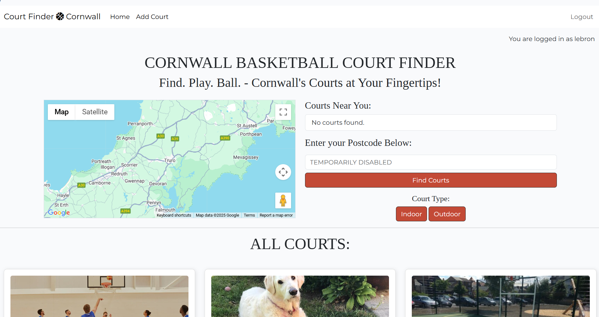


### Add Court Page Template (add_court.html):

The template features a structured form that allows users to add new basketball courts to the site. This form is built using fields from the previously defined Court Model, ensuring that all submitted data aligns with the database structure.

To maintain accuracy and consistency, the form is designed to capture essential court details, such as location, surface type, and hoop condition. Additionally, an approval process is implemented, requiring submissions to be reviewed before appearing on the site. This helps prevent inaccurate or duplicate entries, ensuring that the court listings remain reliable and valuable for users.

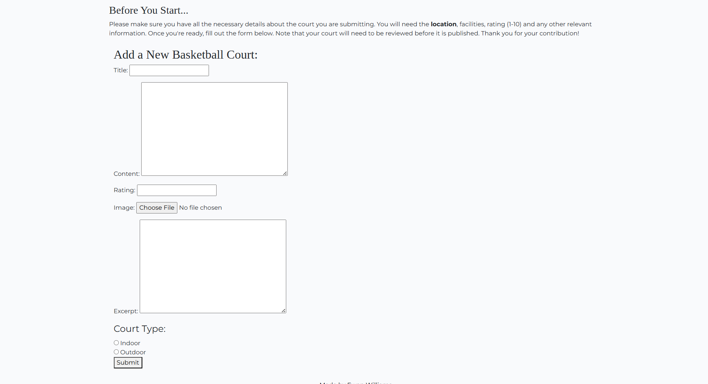

### Court Details Page Template (court_details.html):

**Court Title:** The name of the court, providing easy identification for users.

**Author:** The user who added the court to the database, the person who submitted the court’s details.

**Date Added:** Displays when the court was added to the platform, helping users know how current the information is.

**Rating (1-10):** A rating system from 1 to 10 where users can rate the court based on their experience. This provides an overall sense of the court’s quality, including factors such as the court’s condition, location, and accessibility.

**Court Image:** A photo of the court, giving users a visual idea of the facility. It helps users get a sense of the environment before visiting.

**Court Type:** Indicates whether the court is indoor or outdoor, so users know what to expect when they arrive. This is crucial for planning based on weather conditions or personal preferences.

**Content:** A detailed description of the court’s features and location, including any amenities like lighting, seating, or nearby facilities. This section can also highlight any unique features the court offers, such as a full-sized or half-sized court, adjustable hoops, or whether it’s accessible to wheelchair users.

**Reviews:** Users can share their personal experiences with the court by adding reviews. Reviews can cover various aspects, such as the quality of the court, the atmosphere, ease of access, and general experience. These reviews can help others decide if the court meets their needs.

**Add Review:** Users can submit their own reviews of the court, rating it on a scale from 1 to 10 and leaving comments based on their experience.

**Edit/Delete Reviews:** Users are able to edit or delete their reviews. This feature allows for corrections if a user changes their opinion or notices a mistake in their review. Reviews are user-specific, so each user can only edit or delete their own feedback.

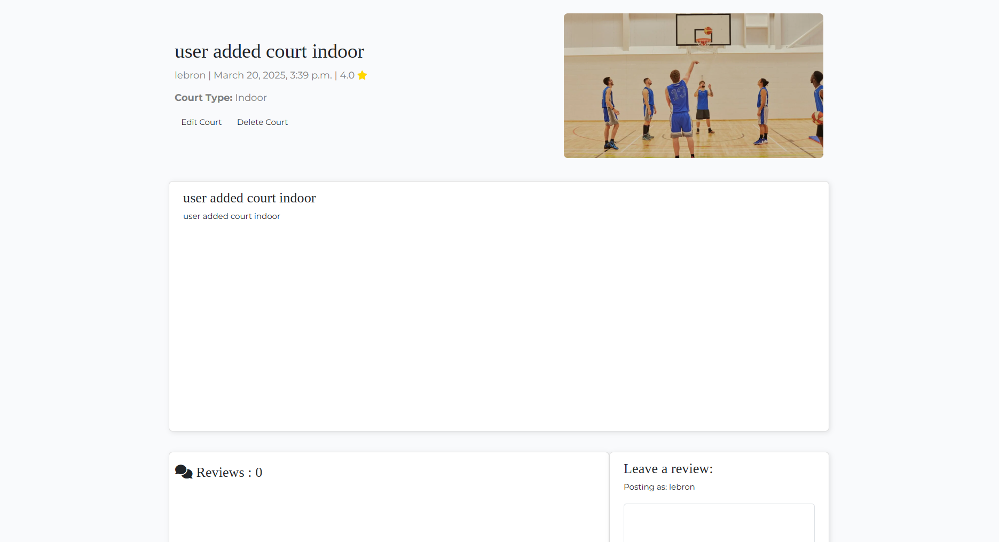

# AI:

## Pair Programming:

Throughout the development of this project, I used AI tools (ChatGPT and Copilot) as part of my pair programming approach. These tools acted as a virtual collaborator, offering suggestions and helping me troubleshoot problems. When working through complex coding challenges, AI assisted in brainstorming solutions and optimising code. This virtual pairing enabled me to rapidly test different approaches and ensured I stayed focused on writing efficient, functional code. It also helped improve my coding style by offering real-time feedback on best practices and suggesting code improvements.

## Debugging:

AI played a significant role in the debugging process by helping me identify issues in my code and offering potential solutions. It provided insights on error messages, suggesting common fixes and optimisations. During the debugging phase, I utilised AI tools like copilot to analyse and pinpoint logical errors, as well as syntax issues. Copilot was significantly useful in quickly solving line too long errors in the problems section of terminal. This greatly sped up the debugging process, allowing me to correct problems quickly and efficiently. Additionally, AI such as ChatGPT provided explanations for error codes and  why certain bugs occurred and how to avoid them in future code, enhancing my understanding of potential pitfalls and improving my overall development skills.

# Testing and Validation:

## VSCode Problems tab:

VSCode has helped me identify maybe errors and syntax problems throguh there problems tab, however instances of this have been unavoidable as of right now:

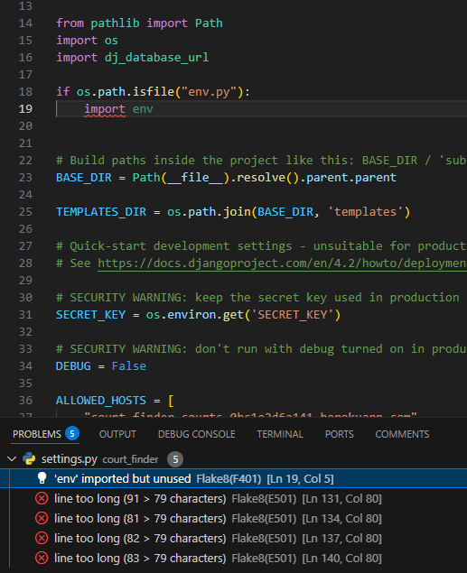

This errors states that env is imported but unused, however the cause of this error is due to the if statement previously before it.

in settings and env there are a total of 6 errors for line too long, these are all for keys and URL's, hence have been deemed acceptable.

## HTML Validation:

All HTML pages were validated using the W3C Markup Validation Service, as the base.html is included in the other templates testing for it is done on each other validation.

index.html Validation
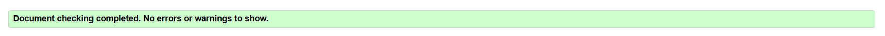

add_court.html Validation


some time had to be spend fixing court_type not being rendered in a p to avoid validaiton error this was the corrected code

<!-- Render everything using form.as_p except court_type -->
      
      
      <p>
        {{ field.label_tag }} {{ field }}
        
        <span class="error">{{ field.errors }}</span>
        
      </p>
      
      

      <!-- Render court_type separately to avoid issues -->
      <fieldset>
        <legend>Court Type:</legend>
        {{ form.court_type }}
      </fieldset>

court_detail.html Validation


## CSS Validation:

The style.css file was validated using the W3C CSS Validation Service

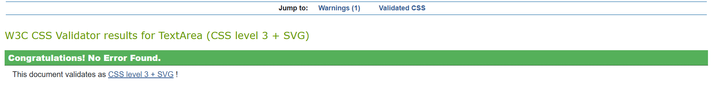

## Javascript Validation:

The js files were validated using the validator at JSLint.com


## Python Validation:

All python files were validated using the Code Institute Python Linter and no errors were found 

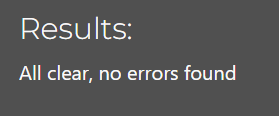


## Tests:

### Responsiveness Test:

Responsiveness tests were carried out using Google Chrome with the Accessibility Properties. Different resolutions were tested to ensure no problems with the siteat each one.

### Account Signup, Login, Logout, and Access Tests:

| Test              | Result |
| :---------------- | :------: |
| Create user account    | Pass |
| Log in             | Pass |
| Log out           | Pass |
| Superuser can access admin page | Pass |
| Non Superusers cannot access admin page | Pass |
| Users cannot edit or review each others' reviews or courts | Pass |


### Adding Court Tests:

| Test              | Result |
| :---------------- | :------: |
| User can add a court   | Pass |
| Not signed in users cannot add a court   | Pass |
| User cannot enter an empty court | Pass |
| User can edit a court   | Fail |
| User can delete a court | Fail |
| Admin can approve court through the admin panel | Pass |

Currently users cannot edit or delete courts, this **functionality is WIP**

### Adding Court Review Tests:

| Test              | Result |
| :---------------- | :------: |
| User can add a review   | Pass |
| Not signed in users cannot add a review   | Pass |
| User cannot enter an empty review | Pass |
| User can edit a review   | Pass |
| User can delete a review | Pass |
| Admin can approve review through the admin panel | Pass |

# Deployment:

The repo was created in Github. Repo was then cloned to VS Code where it was created and updated back to github.

The app was deployed on [Heroku here](https://court-finder-courts-0bc1e2d6a141.herokuapp.com/)

Secret Keys were connected to config vars in Heroku.

The Code Institute PostGres database was connected in Heroku.


# Future Features:

Some features which were planned but left for future versions were:

- **dark mode** dark mode that changes theme from light to dark for accessibility 
- **fix favicon** favicon currently doesnt load and i cant seem to fix it in any way thats simple
- **edit/delete courts** 
- **location field in court model** address field that converts to corrdinates to be used with google maps to display court locations on map
- **markers on map** markers are clickable and take you to the court page
- **enter postcode field** be able to enter postcode and have the page change to show the courts nearest to you
- **indoor/outdoor buttons** add functionality to outdoor/indoor buttons so they filter out indoor or outdoor courts when pressed
- **am i responsive image** 

# Credits and Thanks:

Thank you to [Google Maps Dev](https://console.cloud.google.com/google/maps-apis/build?inv=1&invt=Abs-RA&project=gold-optics-454319-d0) for Map code and their API.

Credit also is accreddited to Code Institute as many coding principles came from their "I think therefore I blog" walkthrough module.

I would like to thank my entire bootcamp cohort and facilitators for being great people and coders!!!